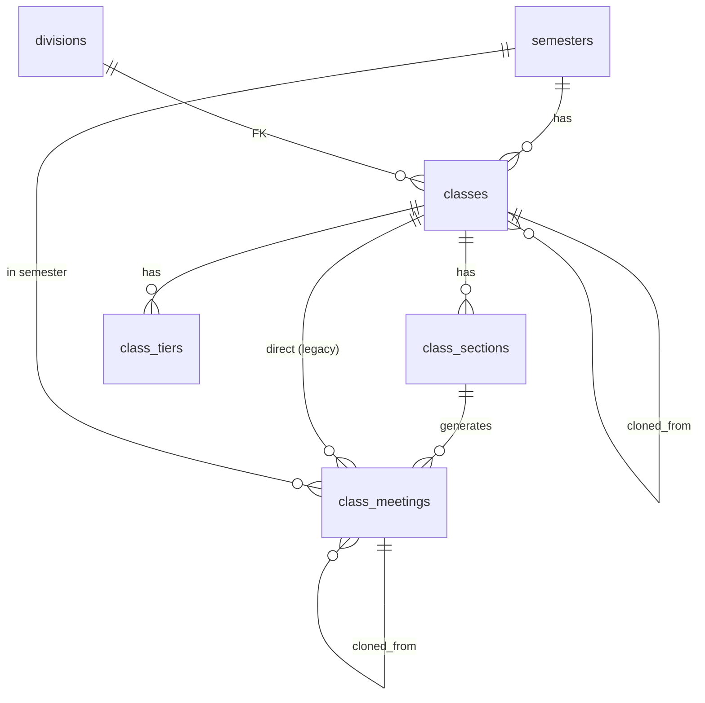
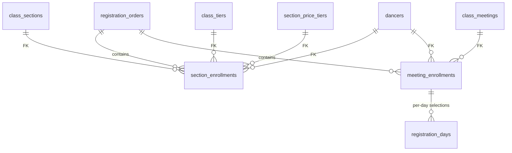
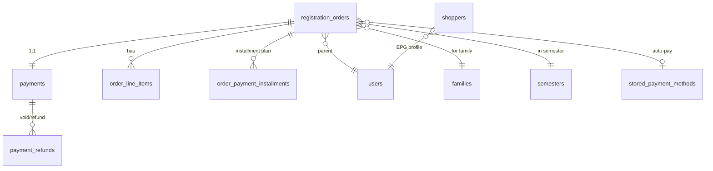

# Database Schema Reference

> Current schema snapshot — post-rename, 2026-05-22.
> **For rename history & rationale:** see [DB_RENAME_PLAN.md](./DB_RENAME_PLAN.md).
> **Older domain docs** (`CLASS_SESSION_ARCHITECTURE.md`, `CLASS_CATALOG.md`) describe the model but use **pre-rename names** — the data model still holds, only the identifiers changed (see the rename plan's mapping table).

---

## §1. Domain in plain English

```
semesters
   └── classes                     (catalog entry, e.g. "Ballet 3")
         ├── class_sections        (recurring offering: days/time/date-range/capacity/pricing)
         │      └── class_meetings (one row per calendar date, fanned out from a section)
         └── class_tiers           (per-class price tiers, when classes.is_tiered = true)
```

A family checks out → produces one `registration_orders` row (the order), with `order_line_items` for what was bought and `order_payment_installments` for the payment schedule. EPG transactions land in `payments` (+ `payment_refunds` for void/refund).

A dancer enrolls in either grain:
- **section_enrollments** → enrolled in a whole `class_section` (full term, `pricing_model = full_schedule`).
- **meeting_enrollments** → booked into a single `class_meeting` (drop-in / per-meeting, `pricing_model = per_session`).

The app layer still calls `meeting_enrollments` "registrations" everywhere (intentional DB/app naming gap — see §3).

Around that core, there are satellites for: requirements/eligibility, class access (invites + auditions), discounts/coupons/credits, special-program tuition, attendance, instructor notes, email/SMS comms, and media.

---

## §2. Quick reference — every table

| Table | Domain | What it is |
|---|---|---|
| `semesters` | Catalog | A term (Fall 2026 etc.) — top-level container |
| `classes` | Catalog | A class offering ("Ballet 3") within a semester |
| `class_sections` | Catalog | Recurring pattern: days/time/date-range/capacity/pricing |
| `class_meetings` | Catalog | One calendar date generated from a section |
| `class_tiers` | Catalog | Per-class price tiers (when `classes.is_tiered`) |
| `divisions` | Catalog | Lookup: early_childhood/junior/senior/competition/adult |
| `class_meeting_excluded_dates` | Meeting | Dates suppressed from per-section generation (per-meeting variant) |
| `class_meeting_instructors` | Meeting | Instructor(s) assigned to a meeting |
| `class_meeting_options` | Meeting | Purchasable add-ons on a meeting |
| `class_meeting_price_rows` | Meeting | Legacy per-date price overrides (largely superseded) |
| `meeting_occurrence_dates` | Meeting | Specific dates a meeting recurs (legacy; mostly empty now) |
| `meeting_groups` | Meeting | Named groupings of meetings (e.g. weekly cohort) |
| `meeting_group_meetings` | Meeting | Junction: meeting_group ↔ class_meetings |
| `meeting_group_tags` | Meeting | Tags on a meeting group |
| `meeting_tags` | Meeting | Tags on individual meetings |
| `class_section_excluded_dates` | Section | Dates the section's generator skips |
| `section_price_tiers` | Section | Price tiers within a section (Mode A) |
| `class_requirements` | Eligibility | Prerequisites / concurrent / audition / etc. |
| `class_requirement_approved_dancers` | Eligibility | Pre-approved dancers for a requirement |
| `requirement_waivers` | Eligibility | Admin waivers of a requirement |
| `concurrent_enrollment_groups` | Eligibility | OR-logic concurrent enrollment rules |
| `concurrent_enrollment_options` | Eligibility | One option within a concurrent-enrollment group |
| `enrollment_warnings` | Eligibility | Soft warns + blocked attempts log |
| `class_invites` | Access | Invite tokens / invite-only access codes |
| `invite_events` | Access | Telemetry on invite send/open/click/register |
| `audition_sessions` | Access | Audition time slots for classes that require audition |
| `audition_bookings` | Access | A dancer's booking of an audition slot |
| `users` | People | App users (admin/instructor/parent) |
| `dancers` | People | Students enrolled |
| `families` | People | Household grouping |
| `family_contacts` | People | Emergency / alternate contacts |
| `authorized_pickups` | People | Approved pickup people |
| `section_enrollments` | Enrollment | Full-term enrollment in a section |
| `meeting_enrollments` | Enrollment | Per-meeting booking (drop-in) — app layer calls this "registrations" |
| `registration_days` | Enrollment | Per-day selection within a meeting enrollment |
| `registration_orders` | Orders | A checkout / order (cart, totals, payment plan) |
| `order_line_items` | Orders | Line items on an order (tuition, fees, discounts) |
| `order_payment_installments` | Orders | Scheduled installment payments for an order |
| `payments` | Payments | EPG payment intent + state |
| `payment_refunds` | Payments | Void/refund operations on a payment |
| `shoppers` | Payments | Elavon (EPG) shopper records |
| `stored_payment_methods` | Payments | Saved cards/ACH for stored-payer charges |
| `discounts` | Discounts | Auto discount definitions (multi-person/multi-session/custom) |
| `discount_rules` | Discounts | Threshold rules for a discount |
| `discount_rule_sections` | Discounts | Sections a rule applies to |
| `discount_rule_meetings` | Discounts | Meetings a rule applies to |
| `discount_coupons` | Discounts | Manually-entered coupon codes |
| `coupon_redemptions` | Discounts | Coupon usage log |
| `coupon_session_restrictions` | Discounts | Coupon limited to specific meetings |
| `family_account_credits` | Credits | Family-level account credit (issued / used in an order) |
| `special_program_tuition` | Tuition | Flat per-program tuition (overrides rate bands) |
| `tuition_rate_bands` | Tuition | Tuition by division × hours/week bands |
| `semester_fee_config` | Tuition | Per-semester fees/discount knobs |
| `semester_payment_plans` | Tuition | Plan types available (pay_in_full / deposit / installments) |
| `semester_payment_installments` | Tuition | Per-semester installment schedule template |
| `semester_coupons` | Tuition | Which coupons are valid in which semester |
| `semester_discounts` | Tuition | Which discounts are active in which semester |
| `attendance` | Operations | Per-meeting attendance marks |
| `instructor_student_notes` | Operations | Instructor's private notes on a dancer |
| `emails` | Comms | Email send (admin-composed) |
| `email_templates` | Comms | Reusable email templates |
| `email_recipients` | Comms | Resolved recipient list for an email |
| `email_recipient_selections` | Comms | Selection criteria for an email's audience |
| `email_activity_logs` | Comms | Admin actions on an email (create/edit/send) |
| `email_deliveries` | Comms | Per-recipient delivery state (Resend hooks) |
| `email_subscribers` | Comms | Subscriber list (external to user accounts) |
| `email_subscriptions` | Comms | Per-user email subscription preference |
| `notification_subscription_emails` | Comms | Outbound "back-in-stock" / waitlist notifications |
| `sms_notifications` | Comms | SMS messages sent (Twilio) |
| `media_folders` | Media | Folder taxonomy for media library |
| `media_images` | Media | Uploaded images |
| `semester_audit_logs` | Audit | Admin action log on a semester |
| `waitlist_entries` | Enrollment | Waitlist queue + invitations *(schema not in snapshot)* |

---

## §3. Column normalization candidates (open for your decision)

These are the inconsistencies the rename project left behind. Each is **cosmetic** — everything works — but worth deciding before they accrete more.

### 3.1 `*batch_id` → `*order_id` columns (10 FKs to `registration_orders`)

The table is now `registration_orders`, but FK columns pointing at it still carry the legacy `batch` name. The columns and their tables:

| Table | Current column | Suggested |
|---|---|---|
| `meeting_enrollments` | `registration_batch_id` | `order_id` (or `registration_order_id`) |
| `payments` | `registration_batch_id` (UNIQUE) | `order_id` |
| `order_line_items` | `batch_id` | `order_id` |
| `order_payment_installments` | `batch_id` | `order_id` |
| `payment_refunds` | `batch_id` | `order_id` |
| `section_enrollments` | `batch_id` | `order_id` |
| `family_account_credits` | `source_batch_id` | `source_order_id` |
| `family_account_credits` | `used_in_batch_id` | `used_in_order_id` |
| `enrollment_warnings` | `batch_id` | `order_id` |
| `coupon_redemptions` | `registration_batch_id` | `order_id` |

**Trade-off:** ~85 code refs (mostly `.eq("batch_id", ...)` + select strings + accesses). Same atomic-sweep pattern as `schedule_id → section_id` and `session_id → meeting_id`.

### 3.2 Stripe-leftover columns (EPG backend)

The payment processor is Elavon (EPG); these columns still carry Stripe vocabulary:

| Table | Column | Notes |
|---|---|---|
| `meeting_enrollments` | `payment_intent_id`, `stripe_amount_cents` | Unused in the EPG flow |
| `registration_orders` | `payment_intent_id` (UNIQUE), `stripe_amount_cents` | Likely unused; verify before drop |
| `payments` | `order_id` (text!), `payment_session_id`, `transaction_id` | These are **EPG** field names, fine — but `order_id` here is unrelated to `registration_orders.id` and reads ambiguous. Consider `epg_order_id`. |

### 3.3 Tables still carrying old vocabulary in their name

| Table | Issue | Suggested |
|---|---|---|
| `coupon_session_restrictions` | "session" in the table name; FK column already renamed to `meeting_id` | `coupon_meeting_restrictions` |
| `registration_days` | "registration" reads stale now that the parent table is `meeting_enrollments` | `meeting_enrollment_days` (column `registration_id` → `meeting_enrollment_id`) |
| `order_line_items` `schedule_enrollment_id` column | Column name still says "schedule"; table was renamed to `section_enrollments` | `section_enrollment_id` |

### 3.4 Enum / column values that still say "session"

| Table.column | Stale value(s) | Suggested |
|---|---|---|
| `email_recipient_selections.selection_type` | `'session'` (CHECK constraint allows this) | `'meeting'` |
| `discounts.give_session_scope` | column name | `give_meeting_scope` (or `give_scope`) |
| `discounts.eligible_sessions_mode`, `discount_coupons.eligible_sessions_mode` | column name | `eligible_meetings_mode` |
| `discounts.category` | values include `'multi_session'` | `'multi_meeting'` |
| `discount_rules.rule_type`, `.threshold_unit` | values include `'multi_session'` / `'session'` | `'multi_meeting'` / `'meeting'` |
| `discount_coupons.eligible_sessions_mode` | column + check values | mirror above |

### 3.5 Constraint names (very cosmetic, never user-visible)

After every `ALTER TABLE ... RENAME`, the table moves to its new name but **constraint and index names keep their old text**. E.g. on `class_meetings`:

```
class_sessions_pkey
class_sessions_class_id_fkey
class_sessions_semester_id_fkey
class_sessions_cloned_from_session_id_fkey
class_sessions_schedule_id_fkey
class_sessions_instructor_id_fkey
```

Same applies to dozens more across the schema. Renaming them is `ALTER TABLE ... RENAME CONSTRAINT old TO new` per constraint — low risk, but tedious and **affects PostgREST FK-hint syntax** if any code uses `target!constraint_name(...)` hints. (Currently only a few do — see DB_RENAME_PLAN.md §1.)

### 3.6 Other small inconsistencies

| Issue | Where |
|---|---|
| `class_meetings.cloned_from_meeting_id` (self-ref) vs `classes.cloned_from_class_id` (self-ref) — naming inconsistent | Could standardize on `parent_*_id` or `clone_source_*_id`. Cosmetic. |
| `class_meetings.instructor_name` vs `class_meetings.instructor_id` | `instructor_name` is the legacy text field; `instructor_id` is the FK. Could drop `instructor_name` if fully migrated. |
| `divisions.is_drop_in` AND `class_sections.is_drop_in` | Phase 4 was supposed to remove the legacy fallback on `divisions`; verify before deleting. |

---

## §4. Tables by domain

Column format used below:
- **`name`** type — note (`→ table.col` indicates an FK).
- Standard `id uuid pk` and `created_at`/`updated_at` are listed but uncommented where typical.

### 4.1 Catalog & structure



#### `semesters`
A term (Fall 2026, Summer 2027, etc.) — top-level container for catalog, registration form, confirmation email, waitlist settings.

- **`id`** uuid pk
- **`name`** text
- **`description`** text
- **`status`** text — `draft | scheduled | published | archived`
- **`tracking_mode`** boolean
- **`capacity_warning_threshold`** integer
- **`registration_form`** jsonb — admin-defined form schema
- **`confirmation_email`** jsonb
- **`waitlist_settings`** jsonb
- **`publish_at`**, **`published_at`** timestamptz
- **`registration_open_at`** timestamptz
- **`location`** text
- **`deleted_at`** timestamptz — soft delete
- **`created_by`**, **`updated_by`** uuid → users.id

Referenced by: `classes`, `class_sections`, `class_meetings`, `audition_sessions`, `meeting_groups`, `semester_*`, `special_program_tuition`, etc.

#### `divisions`
Lookup table for division (early_childhood / junior / senior / competition / adult). `is_drop_in = true` on the `adult` row historically marked drop-in classes; that flag has moved to `class_sections.is_drop_in` and `classes.is_tiered`/division. Phase 4 should remove the fallback.

- **`id`** text pk — short slug (`'junior'`, etc.)
- **`label`** text
- **`sort_order`** integer
- **`is_drop_in`** boolean — **legacy** (see §3.6)

Referenced by: `classes.division`, `tuition_rate_bands.division`.

#### `classes`
The catalog entry. One row per class offering in a semester.

- **`id`** uuid pk
- **`semester_id`** → semesters.id
- **`name`** text — internal
- **`display_name`** text — public-facing
- **`discipline`** text — default `'ballet'`
- **`division`** text → divisions.id (nullable)
- **`description`** text
- **`min_age`**, **`max_age`** integer · **`min_age_months`**, **`max_age_months`** integer (months take precedence for early-childhood)
- **`min_grade`**, **`max_grade`** integer
- **`is_active`** boolean
- **`is_competition_track`** boolean · **`requires_teacher_rec`** boolean · **`requires_parent_accompaniment`** boolean
- **`is_tiered`** boolean — when true, dancer picks a `class_tiers` row at checkout
- **`enrollment_type`** text — `standard | audition`
- **`visibility`** text — `public | hidden | invite_only`
- **`invite_email`**, **`audition_booking_email`**, **`competition_acceptance_email`** jsonb — per-class email overrides
- **`registration_note`** text
- **`tuition_override_amount`** numeric — overrides rate bands when set
- **`cloned_from_class_id`** → classes.id (self-ref)

Referenced by: `class_sections`, `class_meetings`, `class_tiers`, `class_requirements`, `concurrent_enrollment_groups`, `concurrent_enrollment_options`, `class_invites`, `audition_sessions`, `audition_bookings`, `email_recipient_selections`.

#### `class_sections`
The recurring section — admin-configured. The system fans this out into one `class_meetings` row per matching weekday in the date range. The name was `class_schedules` pre-rename; it is not a calendar/timetable, it is the recipe.

- **`id`** uuid pk
- **`class_id`** → classes.id
- **`semester_id`** → semesters.id (denormalized for trigger access)
- **`days_of_week`** text[] — `['monday','wednesday']`
- **`start_time`**, **`end_time`** time · **`start_date`**, **`end_date`** date
- **`location`**, **`instructor_name`** text
- **`capacity`** integer
- **`registration_open_at`**, **`registration_close_at`** timestamptz
- **`gender_restriction`** text — `male | female | no_restriction`
- **`urgency_threshold`** integer
- **`pricing_model`** text — **`full_schedule`** (Mode A, full-term enrollment in this section) or **`per_session`** (Mode B, drop-in by meeting). Drives which enrollment table is written.
- **`is_drop_in`** boolean — newer per-section flag (Phase 2)

Referenced by: `class_meetings.section_id`, `section_enrollments`, `section_price_tiers`, `class_section_excluded_dates`, `discount_rule_sections`.

#### `class_meetings`
One generated calendar date — a single meeting. Fanned out from a section; legacy rows may have null `section_id`.

- **`id`** uuid pk
- **`class_id`** → classes.id
- **`semester_id`** → semesters.id
- **`section_id`** → class_sections.id (nullable on legacy)
- **`day_of_week`** text — monday..sunday
- **`start_time`**, **`end_time`** time
- **`start_date`**, **`end_date`** date
- **`schedule_date`** date — **the specific calendar date this meeting occurs** (NULL on legacy rows)
- **`location`** text
- **`instructor_name`** text — legacy text
- **`instructor_id`** → users.id — newer FK
- **`capacity`** integer
- **`drop_in_price`** numeric — NULL when section is `full_schedule`; set at generation time for `per_session`
- **`registration_open_at`**, **`registration_close_at`** timestamptz
- **`gender_restriction`** text · **`urgency_threshold`** integer
- **`cloned_from_meeting_id`** → class_meetings.id (self-ref)
- **`cancelled_at`** timestamptz · **`cancellation_reason`** text
- **`is_active`** boolean

Referenced by: `attendance`, `class_meeting_*` satellites, `meeting_group_meetings`, `meeting_occurrence_dates`, `meeting_tags`, `coupon_session_restrictions`, `discount_rule_meetings`, `email_recipient_selections`, `enrollment_warnings`, `meeting_enrollments`, `order_line_items`, `waitlist_entries`.

#### `class_tiers`
Per-class price tier rows (used when `classes.is_tiered = true`). Distinct from `section_price_tiers`.

- **`id`** uuid pk
- **`class_id`** → classes.id
- **`label`** text
- **`start_time`**, **`end_time`** time — tier-specific time window
- **`price_cents`** integer (nullable; null = inherit)
- **`sort_order`** integer · **`is_default`** boolean

Referenced by: `section_enrollments.class_tier_id`.

### 4.2 Meeting satellites

#### `class_meeting_excluded_dates`
Dates suppressed from a meeting (per-meeting exclusions, distinct from `class_section_excluded_dates`).
- **`class_meeting_id`** → class_meetings.id · **`excluded_date`** date · **`reason`** text.

#### `class_meeting_instructors`
Junction: instructor(s) per meeting.
- **`meeting_id`** → class_meetings.id · **`user_id`** → users.id · **`is_lead`** boolean.

#### `class_meeting_options`
Purchasable add-ons on a meeting (e.g. "costume", "snack").
- **`class_meeting_id`** → class_meetings.id · **`name`**, **`description`** text · **`price`** numeric · **`is_required`** boolean · **`sort_order`** integer.

#### `class_meeting_price_rows`
Legacy per-date price overrides. Mostly superseded by `section_price_tiers` and `drop_in_price`. Verify usage before relying on it.
- **`class_meeting_id`** → class_meetings.id · **`label`** text · **`amount`** numeric · **`sort_order`** integer · **`is_default`** boolean.

#### `meeting_groups`
Named groupings of meetings (e.g. "Saturday cohort"). Used for email targeting and reporting.
- **`semester_id`** → semesters.id · **`name`**, **`description`** text.

#### `meeting_group_meetings`
Junction: meeting_group ↔ class_meetings.
- **`meeting_group_id`** → meeting_groups.id · **`meeting_id`** → class_meetings.id.

#### `meeting_group_tags`
Tags on a meeting group.
- **`meeting_group_id`** → meeting_groups.id · **`tag`** text.

#### `meeting_tags`
Tags on individual meetings.
- **`meeting_id`** uuid (no FK constraint in snapshot — verify) · **`tag`** text.

#### `meeting_occurrence_dates`
Legacy per-date occurrence list (when a meeting recurs across dates). Mostly empty now since per-date data is on `class_meetings.schedule_date`.
- **`meeting_id`** → class_meetings.id · **`date`** date · **`is_cancelled`** boolean · **`cancellation_reason`** text.

### 4.3 Section satellites

#### `class_section_excluded_dates`
Dates the section's generator skips when producing `class_meetings`.
- **`section_id`** → class_sections.id · **`excluded_date`** date · **`reason`** text.

#### `section_price_tiers`
Mode-A schedule-level price tiers (e.g. "Regular", "Scholarship") per section.
- **`section_id`** → class_sections.id · **`label`** text · **`amount`** numeric · **`sort_order`** integer · **`is_default`** boolean.

Referenced by: `section_enrollments.price_tier_id`.

### 4.4 Eligibility & requirements

#### `class_requirements`
Per-class rules: prerequisite, concurrent enrollment, audition required, parent accompaniment, etc.
- **`class_id`** → classes.id
- **`requirement_type`** text — `prerequisite_completed | concurrent_enrollment | teacher_recommendation | audition_required | parent_accompaniment`
- **`required_discipline`**, **`required_level`** text · **`required_class_id`** → classes.id
- **`description`** text · **`enforcement`** text (`hard_block | soft_warn`) · **`is_waivable`** boolean.

#### `class_requirement_approved_dancers`
Pre-approved dancer overrides on a requirement.
- **`class_requirement_id`** → class_requirements.id · **`dancer_id`** → dancers.id.

#### `requirement_waivers`
Admin-granted waivers of a requirement for a specific dancer.
- **`class_requirement_id`** → class_requirements.id · **`dancer_id`** → dancers.id · **`granted_by_admin_id`** → users.id · **`notes`** text · **`expires_at`** timestamptz.

#### `concurrent_enrollment_groups`
OR-logic group of acceptable concurrent enrollments for a class (e.g. "third weekly class can be any of: Ballet 4, Open 4, Open 5").
- **`class_id`** → classes.id · **`group_label`** text · **`description`** text · **`enforcement`** text · **`is_waivable`** boolean.

#### `concurrent_enrollment_options`
One acceptable concurrent-enrollment option inside a group.
- **`group_id`** → concurrent_enrollment_groups.id · **`class_id`** → classes.id (nullable) · **`discipline`**, **`level`** text — at least one of `class_id` or `discipline` must be set.

#### `enrollment_warnings`
Log of soft warnings + hard blocks the validator surfaced at checkout. Useful for reporting + admin review.
- **`batch_id`** → registration_orders.id (nullable; hard-block rows have null) — *NB: name still `batch_id` (§3.1)*
- **`family_id`** → families.id · **`dancer_id`** → dancers.id · **`meeting_id`** → class_meetings.id · **`semester_id`** → semesters.id
- **`warning_type`** text · **`enforcement`** text (`soft_warn | hard_block`) · **`message`** text · **`requirement_id`** uuid
- **`is_reviewed`** boolean · **`reviewed_by`** → users.id · **`reviewed_at`** timestamptz.

### 4.5 Class access — invites & auditions

#### `class_invites`
Invite tokens or token-link access for invite-only classes.
- **`class_id`** → classes.id · **`access_type`** (`invite_only | token_link | hybrid`)
- **`email`** text · **`dancer_id`** → dancers.id
- **`invite_token`** uuid UNIQUE · **`expires_at`** timestamptz · **`max_uses`**, **`use_count`** integer
- **`status`** (`pending | sent | opened | registered | expired | revoked`) · **`sent_at`**, **`opened_at`** timestamptz
- **`created_by`** → users.id · **`notes`** text.

#### `invite_events`
Telemetry for an invite (sent / opened / clicked / registered / etc.).
- **`invite_id`** → class_invites.id · **`event_type`** text · **`audition_booking_id`** → audition_bookings.id
- **`ip_address`**, **`user_agent`** text · **`metadata`** jsonb.

#### `audition_sessions`
Audition time slots for classes whose `enrollment_type = 'audition'`.
- **`class_id`** → classes.id · **`semester_id`** → semesters.id
- **`label`** text · **`start_at`**, **`end_at`** timestamptz · **`location`** text · **`capacity`** integer
- **`price`** numeric · **`notes`** text · **`is_active`** boolean.

⚠️ **Not the same as `class_meetings`** — audition_sessions are dance-audition slots, a separate subsystem. Their `audition_session_id` FK column is distinct from any meeting FK.

#### `audition_bookings`
A booking against an audition slot.
- **`audition_session_id`** → audition_sessions.id · **`class_id`** → classes.id
- **`invite_id`** → class_invites.id · **`dancer_id`** → dancers.id · **`parent_id`** → users.id
- **`guest_name`**, **`guest_email`** text — for booking without a user account
- **`status`** (`confirmed | cancelled | no_show`) · **`amount_paid`** numeric · **`payment_status`** (`unpaid | paid | waived`) · **`notes`** text.

### 4.6 People & families

#### `users`
*(Schema not in snapshot — base table is `public.users` with FK to `auth.users`.)*

Holds admin/instructor/parent profiles. Referenced everywhere as actor (`created_by`, `parent_id`, `instructor_id`, etc.). Columns include name, role flags, signature config, and address fields per recent migrations.

#### `dancers`
Students. May or may not have their own user account (`is_self`).
- **`family_id`** → families.id · **`user_id`** → users.id
- **`first_name`**, **`middle_name`**, **`last_name`** text · **`gender`** text · **`birth_date`** date · **`grade`** text
- **`email`**, **`phone_number`** · **`secondary_email`** · **`school`** text
- **`address_line1`**, **`address_line2`**, **`city`**, **`state`**, **`zipcode`** text
- **`is_self`** boolean · **`is_student_contact_priority`** boolean.

#### `families`
A household.
- **`family_name`** text (NB: column is `family_name`, not `name` — per `CLAUDE.md` rules).

Referenced by: `dancers`, `family_contacts`, `authorized_pickups`, `registration_orders`, `coupon_redemptions`, `family_account_credits`, `email_recipients`, `email_recipient_selections`.

#### `family_contacts`
Additional contacts on a family (emergency, alternate parent, caregiver).
- **`family_id`** → families.id · **`type`** (`emergency_contact | alternate_parent | caregiver`)
- **`first_name`**, **`last_name`**, **`phone`**, **`email`**, **`relationship`** text · **`is_authorized_pickup`** boolean · **`notes`** text.

#### `authorized_pickups`
Approved pickup people (separate from family_contacts so the UI can model them differently).
- **`family_id`** → families.id · **`first_name`**, **`last_name`**, **`phone_number`**, **`relation`** text.

### 4.7 Enrollment



#### `section_enrollments`
Full-term enrollment in a `class_sections` row. One per `(dancer, section)`. Capacity + time-conflict triggers fire on insert.

- **`section_id`** → class_sections.id
- **`batch_id`** → registration_orders.id — *§3.1: `order_id`*
- **`dancer_id`** → dancers.id
- **`price_tier_id`** → section_price_tiers.id (Mode A tier)
- **`class_tier_id`** → class_tiers.id (per-class tier picked at checkout)
- **`price_snapshot`** numeric — immutable at create
- **`status`** (`pending | confirmed | cancelled`).

#### `meeting_enrollments`
Per-meeting booking (drop-in / per_session). Triggers fire on insert: `check_session_capacity`, `check_registration_time_conflict`.

> ℹ️ **DB/app naming gap:** the table is `meeting_enrollments` but the application layer (PostgREST result keys, TS type names like `BatchRegistration`, `.registrations` accesses, "Registrations" UI labels) still says **registrations** — embeds carry an alias (`registrations:meeting_enrollments(...)`) to preserve this. Intentional, see DB_RENAME_PLAN.md §3.

- **`dancer_id`** → dancers.id · **`user_id`** → users.id
- **`meeting_id`** → class_meetings.id (renamed from `session_id`)
- **`registration_batch_id`** → registration_orders.id — *§3.1: `order_id`*
- **`status`** (`pending_payment | confirmed | cancelled`)
- **`payment_intent_id`** text, **`stripe_amount_cents`** integer — *§3.2 Stripe-leftover, likely unused*
- **`form_data`** jsonb · **`total_amount`** numeric · **`hold_expires_at`** timestamptz (used by `expire_stale_registration_holds` cron).

#### `registration_days`
Per-day selection within a meeting enrollment (e.g. dancer signed up for the camp but only on Mon+Wed).

- **`registration_id`** → meeting_enrollments.id — *§3.3 name carries old "registration" prefix*
- **`available_day_id`** uuid · **`day`** date.

### 4.8 Orders & payments



#### `registration_orders`
The checkout / order. One row per family per checkout. Holds totals, payment plan, cart snapshot. (Was `registration_batches`.)

- **`parent_id`** → users.id · **`semester_id`** → semesters.id · **`family_id`** → families.id
- **`cart_snapshot`** jsonb · **`form_data`** jsonb · **`admin_adjustments`** jsonb
- **`status`** (`pending | confirmed | failed | refunded`) · **`confirmed_at`** timestamptz
- Totals: **`tuition_total`**, **`registration_fee_total`**, **`recital_fee_total`**, **`family_discount_amount`**, **`auto_pay_admin_fee_total`**, **`grand_total`**, **`amount_due_now`** numeric
- **`payment_plan_type`** text — `pay_in_full | installments | deposit_flat | deposit_percent`
- **`payment_intent_id`** text UNIQUE — *§3.2 Stripe-named, EPG actually uses it as reference*
- **`stripe_amount_cents`** integer — *§3.2*
- **`payment_reference_id`** text — EPG custom_reference
- **`stored_payment_method_id`** → stored_payment_methods.id (for installments auto-charge).

#### `order_line_items`
Line items on an order. Normalized for both Mode A (full_schedule) and Mode B (drop_in).

- **`batch_id`** → registration_orders.id — *§3.1*
- **`dancer_id`** → dancers.id (NULL for batch-level items like family discount / auto-pay fee)
- **`meeting_id`** → class_meetings.id (set for drop_in)
- **`schedule_enrollment_id`** → section_enrollments.id (set for full_schedule) — *§3.3 column name still says "schedule"*
- **`item_type`** text — `full_schedule | drop_in | option | registration_fee | family_discount | auto_pay_fee`
- **`label`** text · **`unit_amount`**, **`amount`** numeric · **`quantity`** integer.

Constraint: an enrollment line item cannot reference both `meeting_id` and `schedule_enrollment_id` simultaneously.

#### `order_payment_installments`
Scheduled installments for an order's payment plan. Charged automatically when due via the `process-overdue-payments` edge function.

- **`batch_id`** → registration_orders.id — *§3.1*
- **`installment_number`** integer (1-based)
- **`amount_due`** numeric · **`due_date`** date
- **`status`** — `scheduled | paid | overdue | waived | processing | failed`
- **`paid_at`**, **`paid_amount`**, **`payment_reference_id`**, **`transaction_id`** text
- **`charge_attempt_count`** integer · **`last_charge_error`** text · **`failure_reason`** text.

#### `payments`
EPG payment record (one per order). Holds session/transaction state and the raw webhook payloads.

- **`registration_batch_id`** → registration_orders.id UNIQUE — *§3.1: `order_id`*
- **`order_id`** text — *§3.2: this is EPG's order field, not our `registration_orders.id`*
- **`payment_session_id`**, **`transaction_id`** text · **`custom_reference`** text UNIQUE
- **`amount`** numeric · **`currency`** text default `'USD'`
- **`state`** — `initiated | pending_authorization | authorized | captured | settled | declined | voided | refunded | held_for_review`
- **`event_type`** text · **`raw_notification`**, **`raw_transaction`** jsonb.

#### `payment_refunds`
Void/refund actions against a payment.
- **`payment_id`** → payments.id · **`batch_id`** → registration_orders.id (*§3.1*)
- **`type`** (`void | refund`) · **`amount`** numeric · **`reason`** text · **`line_items`** jsonb (refunded line-item details)
- **`initiated_by`** → auth.users.id · **`epg_transaction_id`** text · **`raw_response`** jsonb
- **`status`** (`pending | succeeded | failed`) · **`failure_reason`** text.

#### `shoppers`
EPG shopper profile, one per user. Anchors the `stored_payment_methods` (`shopper_id`).
- **`user_id`** → auth.users.id · **`epg_shopper_id`** text UNIQUE · **`epg_shopper_href`** text
- **`full_name`**, **`email`** text.

#### `stored_payment_methods`
*(Schema not in snapshot — table exists per FK references.)* Stored cards/ACH tokens against a shopper, used to auto-charge installments.

### 4.9 Discounts & credits

#### `discounts`
Auto-applied discount definitions (multi-person / multi-session / custom).
- **`name`** text · **`category`** (`multi_person | multi_session | custom`) — *§3.4: `multi_session` should be `multi_meeting`*
- **`eligible_sessions_mode`** (`all | selected`) — *§3.4 column name*
- **`give_session_scope`** text — *§3.4*
- **`recipient_scope`** (`threshold_only | threshold_and_additional`)
- **`is_active`** boolean.

#### `discount_rules`
Threshold rules attached to a discount.
- **`discount_id`** → discounts.id
- **`rule_type`** (`multi_person | multi_session`) — *§3.4*
- **`threshold`** integer · **`threshold_unit`** (`person | session`) — *§3.4: `session` → `meeting`*
- **`value`** numeric · **`value_type`** (`flat | percent`).

#### `discount_rule_sections`
Sections a discount rule targets (parallel to discount_rule_meetings).
- **`discount_rule_id`** → discount_rules.id · **`section_id`** → class_sections.id.

#### `discount_rule_meetings`
Meetings a discount rule targets.
- **`discount_id`** → discounts.id (NB: targets `discount_id`, not `discount_rule_id` — verify intent)
- **`meeting_id`** → class_meetings.id.

#### `discount_coupons`
Manually-entered coupon codes (separate from auto-applied discounts).
- **`name`** text · **`code`** text UNIQUE
- **`value`** numeric · **`value_type`** (`flat | percent`)
- **`valid_from`**, **`valid_until`** timestamptz
- **`max_total_uses`**, **`uses_count`**, **`max_per_family`** integer · **`stackable`** boolean
- **`eligible_sessions_mode`** (`all | selected`) — *§3.4*
- **`applies_to_most_expensive_only`** boolean
- **`eligible_line_item_types`** text[] — subset of `{tuition, registration_fee, recital_fee}`
- **`is_active`** boolean.

#### `coupon_redemptions`
Coupon-usage log.
- **`coupon_id`** → discount_coupons.id · **`family_id`** → families.id
- **`registration_batch_id`** → registration_orders.id (*§3.1: `order_id`*).

#### `coupon_session_restrictions`
Coupon limited to specific meetings. Table name still says "session" — *§3.3*.
- **`coupon_id`** → discount_coupons.id · **`meeting_id`** → class_meetings.id.

#### `family_account_credits`
Family-level account credit. Issued by admin or system; consumed on a future order.
- **`family_id`** → families.id · **`amount`** numeric · **`reason`** text
- **`issued_by_admin_id`** → users.id
- **`source_batch_id`** → registration_orders.id (where credit was created) — *§3.1: `source_order_id`*
- **`used_in_batch_id`** → registration_orders.id (where it was spent) — *§3.1: `used_in_order_id`*
- **`used_at`** timestamptz · **`is_active`** boolean.

### 4.10 Special programs & semester-level tuition

#### `special_program_tuition`
Per-program flat tuition (overrides rate bands for named programs).
- **`semester_id`** → semesters.id · **`program_key`**, **`program_label`** text
- **`semester_total`** numeric · **`autopay_installment_amount`**, **`autopay_installment_count`**
- **`registration_fee_override`** numeric · **`notes`** text.

#### `tuition_rate_bands`
*(Schema not in snapshot.)* Tuition by division × hours/week bands; the main pricing engine.

#### `semester_fee_config`
Per-semester knobs for registration fee, family discount, auto-pay admin fee, costume/recital fees.
- **`semester_id`** → semesters.id (pk)
- **`registration_fee_per_child`** numeric · **`family_discount_amount`** numeric
- **`auto_pay_admin_fee_monthly`** numeric · **`auto_pay_installment_count`** integer
- **`senior_video_fee_per_registrant`**, **`senior_costume_fee_per_class`**, **`junior_costume_fee_per_class`** numeric
- **`costume_fee_exempt_keys`** text[].

#### `semester_payment_plans`
Available plan types per semester (multi-row possible; pk is `semester_id`).
- **`semester_id`** pk · **`type`** (`pay_in_full | deposit_flat | deposit_percent | installments`)
- **`deposit_amount`**, **`deposit_percent`**, **`installment_count`** · **`due_date`** date.

#### `semester_payment_installments`
Template per-semester installment schedule (the default dates plans use).
- **`semester_id`** · **`installment_number`** · **`amount`** · **`due_date`**.

#### `semester_coupons` / `semester_discounts`
Junction: which coupons/discounts are active in which semester.

### 4.11 Operations — attendance & instructor

#### `attendance`
Per-meeting attendance marks by instructor.
- **`meeting_id`** → class_meetings.id
- **`occurrence_date_id`** → meeting_occurrence_dates.id (nullable; legacy when meetings used the occurrence table)
- **`dancer_id`** → dancers.id
- **`status`** USER-DEFINED enum (`present | absent | late | excused` etc.) · **`note`** text
- **`marked_by`** → users.id.

#### `instructor_student_notes`
Instructor's private notes on a dancer.
- **`instructor_id`** → users.id · **`dancer_id`** → dancers.id
- **`note`** text · **`tag`** (`progress | behavior | goal | general | NULL`).

### 4.12 Communications

#### `emails`
Admin-composed email send.
- **`subject`**, **`body_html`**, **`body_json`** · **`sender_name`**, **`sender_email`**, **`reply_to_email`** · **`include_signature`** boolean
- **`status`** (`draft | scheduled | sent | cancelled | sending | failed`) · **`scheduled_at`**, **`sent_at`** timestamptz
- **`created_by_admin_id`**, **`updated_by_admin_id`** → users.id · **`deleted_at`** timestamptz.

#### `email_templates`
Reusable templates.
- **`name`**, **`subject`**, **`body_html`**, **`body_json`** · **`created_by_admin_id`**, **`updated_by_admin_id`** · **`deleted_at`**.

#### `email_recipient_selections`
Audience selection criteria for an email (per type: semester / class / meeting / subscriber-list / manual).
- **`email_id`** → emails.id
- **`selection_type`** (`semester | session | class | manual | subscribed_list`) — *§3.4: `session` → `meeting`*
- **`semester_id`** → semesters.id · **`class_id`** → classes.id · **`meeting_id`** → class_meetings.id
- **`user_id`** → users.id · **`subscriber_id`** → email_subscribers.id · **`family_id`** → families.id
- **`is_excluded`** boolean · **`include_instructors`** boolean · **`instructor_name`** text.

#### `email_recipients`
Resolved per-email recipient list (post-selection-expansion).
- **`email_id`** → emails.id · **`user_id`**, **`subscriber_id`**, **`family_id`** (nullable)
- **`email_address`**, **`first_name`**, **`last_name`** text · **`dancer_context`** jsonb.

#### `email_deliveries`
Per-recipient delivery state (Resend webhook ingestion).
- **`email_id`** → emails.id · **`user_id`** / **`subscriber_id`** · **`email_address`**
- **`resend_message_id`** · **`status`** (`pending | sent | delivered | bounced | complained | failed`)
- **`delivered_at`**, **`bounced_at`**, **`opened_at`**, **`clicked_at`** timestamptz · **`failure_reason`** text.

#### `email_activity_logs`
Admin actions on an email.
- **`email_id`** → emails.id · **`action`** (`created | edited | scheduled | sent | cancelled | cloned | deleted`) · **`admin_id`** → users.id · **`metadata`** jsonb.

#### `email_subscribers`
External subscriber list (people without app accounts).
- **`email`** text UNIQUE · **`name`**, **`phone`** · **`is_subscribed`** boolean · **`unsubscribed_at`** timestamptz · **`created_by`** → users.id.

#### `email_subscriptions`
Per-user email opt-in/out.
- **`user_id`** pk · **`is_subscribed`** boolean · **`unsubscribed_at`** timestamptz.

#### `notification_subscription_emails`
Outbound "subscribe to be notified" emails (waitlist, semester open, etc.) — separate from `emails` because no admin-composed body.
- **`subscriber_id`** → email_subscribers.id · **`semester_id`** → semesters.id
- **`email`** text · **`resend_message_id`** UNIQUE
- **`status`** · **`sent_at`**, **`delivered_at`**, **`opened_at`**, **`clicked_at`**, **`bounced_at`** timestamptz.

#### `sms_notifications`
Twilio SMS log.
- **`user_id`** → users.id · **`to_phone`**, **`body`**, **`status`** text · **`twilio_sid`** UNIQUE · **`error_message`** text · **`delivered_at`** timestamptz.

### 4.13 Media & audit

#### `media_folders`
Folder labels for the media library.
- **`name`** pk (slug) · **`label`** text.

#### `media_images`
Uploaded images.
- **`display_name`** · **`storage_path`** UNIQUE · **`public_url`** · **`folder`** · **`tags`** text[]
- **`mime_type`** · **`size_bytes`** · **`width`**, **`height`** integer.

#### `semester_audit_logs`
Admin action log on a semester.
- **`semester_id`** → semesters.id · **`action`** text · **`performed_by`** → users.id · **`changes`** jsonb.

### 4.14 Out of snapshot

These tables were referenced via FKs but their full CREATE TABLE was not in the snapshot you pasted. They exist and are active — if you want them detailed here, paste their schema and I'll fill them in:

- **`users`** (`public.users`, FK to `auth.users`) — actor table referenced everywhere
- **`stored_payment_methods`** — saved cards/ACH for stored-payer auto-charging
- **`tuition_rate_bands`** — tuition by division × hours/week
- **`waitlist_entries`** — waitlist queue + invitations (referenced from `class_meetings`)

---

## §5. Conventions used

- `id uuid pk default gen_random_uuid()` is standard; not always called out.
- `created_at timestamptz default now()` and `updated_at timestamptz default now()` likewise.
- Status / type enums are usually `text` with a `CHECK (col = ANY(ARRAY[...]))` constraint, not Postgres `ENUM` types — admin lookup tables (`divisions`) are an exception.
- All cross-table references use `uuid` FKs.
- RLS is enabled on the user-facing tables; admin/service_role policies are stratified — see migrations under `supabase/migrations/`.

---

**Source of truth:** `supabase/migrations/` (chronological). When this doc and the migrations disagree, the migrations win.
