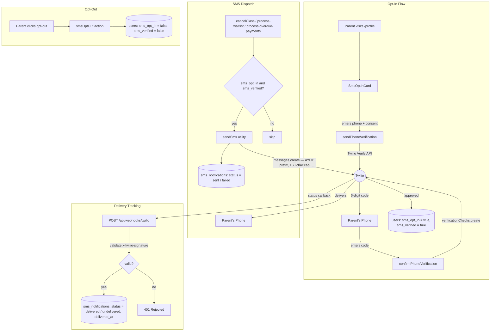

# SMS Notifications Architecture

> Status: **Live — Twilio A2P 10DLC registration complete, SMS delivery active**
> Last updated: 2026-03-27

---

## Architecture Diagram



---

## What Is Built and Working

All code is complete and tested end-to-end:

| Component | File | Status |
|-----------|------|--------|
| Send utility | `utils/sendSms.ts` | Done — E.164 normalization, best-effort, logs every attempt |
| DB schema | `supabase/migrations/20260313000001_sms_opt_in.sql` | Done — `sms_opt_in`, `sms_verified` on `users`; `sms_notifications` table |
| Phone verification (send code) | `app/actions/sendPhoneVerification.ts` | Done |
| Phone verification (confirm code) | `app/actions/confirmPhoneVerification.ts` | Done |
| SMS opt-out | `app/actions/smsOptOut.ts` | Done |
| User profile opt-in card | `app/(user-facing)/profile/SmsOptInCard.tsx` | Done |
| Class cancellation notify | `app/admin/semesters/actions/cancelClass.ts` | Done — email + SMS per enrolled family |
| Waitlist invite notify | `supabase/functions/process-waitlist/index.ts` | Done |
| Payment overdue notify | `supabase/functions/process-overdue-payments/index.ts` | Done |
| Delivery status webhook | `app/api/webhooks/twilio/route.ts` | Done |

**Twilio reaches the message correctly** — confirmed via Twilio Monitor logs. The message payload, phone number formatting, family lookup, and deduplication all work. The only blocker is carrier compliance (see below).

---

## Twilio Account Setup (Current State)

| Item | Status |
|------|--------|
| Twilio account | Active (paid) |
| Purchased phone number | Yes — 10DLC long code |
| A2P 10DLC brand registration | **Complete** |
| A2P 10DLC campaign registration | **Complete** |
| Phone number linked to campaign | **Complete** |

**Required env vars** (set in `.env.local` and Vercel):
```
TWILIO_ACCOUNT_SID=...
TWILIO_AUTH_TOKEN=...
TWILIO_PHONE_NUMBER=+1XXXXXXXXXX     # the purchased 10DLC number
TWILIO_VERIFY_SERVICE_SID=...        # for opt-in verification flow
```

---

## Costs

### Ongoing monthly costs

| Item | Cost |
|------|------|
| Twilio phone number | ~$1.15/month |
| Outbound SMS | ~$0.0079/message |
| Twilio Verify (opt-in codes) | ~$0.05/successful verification |

| Scenario | Volume | Est. Monthly |
|----------|--------|-------------|
| Normal operations | 100–300 SMS | ~$2–4/mo |
| Active semester | 300–700 SMS | ~$4–7/mo |
| Emergency cancellation blast (100 families) | 100 SMS one-time | ~$1 per blast |

**Realistic ongoing cost: $5–10/month** during active semesters.

---

## Provider: Twilio

**Why Twilio:**
- Built-in phone verification via Twilio Verify — satisfies TCPA opt-in requirements
- Delivery status webhooks (mirrored alongside existing Resend email webhooks)
- Reliable at studio scale

**Do not use:**
- AWS SNS — no built-in opt-in management
- Resend — email only, no SMS

---

## When SMS Is Sent

SMS is for **time-sensitive operational alerts only**.

| Event | Channel |
|-------|---------|
| Class cancelled | Email + SMS |
| Waitlist spot opened | Email + SMS |
| Payment overdue | Email + SMS |
| Semester published | Email only |
| Marketing / newsletters | Email only |

All messages are prefixed `AYDT: ` and capped at 160 characters.

---

## Opt-In Flow

1. Parent goes to `/profile` → SMS Notifications card
2. Enters phone number + checks consent checkbox
3. `sendPhoneVerification` server action calls Twilio Verify → 6-digit code sent
4. Parent enters code → `confirmPhoneVerification` verifies with Twilio
5. On success: `sms_opt_in = true`, `sms_verified = true` written to `users` table

SMS is only sent when both `sms_opt_in = true` AND `sms_verified = true`.

---

## A2P 10DLC Campaign Compliance Page

**File:** `app/sms-opt-in/page.tsx`
**Public URL:** `https://aydt.nyc/sms-opt-in`

### Purpose

Twilio rejected the initial A2P 10DLC campaign registration for missing a public call-to-action URL — proof that users explicitly consent before receiving SMS. This page satisfies that requirement.

It is a fully public, static server component (no login required) that shows the real opt-in flow in 4 annotated panels matching the production UI exactly:

| Panel | What it shows |
|-------|--------------|
| 1 — Opt-In Form | Phone input + consent checkbox with exact disclosure language |
| 2 — Phone Verification | 6-digit code entry step |
| 3 — Notification Preferences | The 3 toggles (cancellations, waitlist, payments) |
| 4 — Opt-Out | In-app opt-out button + "Reply STOP" explanation + program disclosure |

The page is permanently public — middleware only protects `/admin` routes.

### Next Steps — Campaign Resubmission

1. Deploy the current branch to production
2. Confirm `https://aydt.nyc/sms-opt-in` loads without login
3. In Twilio Console → Messaging → A2P 10DLC → your campaign → **"Message Flow / Call to Action URL"** field, enter:
   ```
   https://aydt.nyc/sms-opt-in
   ```
4. Resubmit the campaign registration

---

## Testing Checklist

- [x] Phone number E.164 normalization (`8087285029` → `+18087285029`)
- [x] Family lookup via schedule-level registration query
- [x] Duplicate family deduplication (one SMS per family even with 2+ dancers)
- [x] `sms_notifications` row inserted on every attempt (success or failure)
- [x] Twilio receives message request (confirmed in Twilio Monitor logs)
- [ ] End-to-end delivery to real device
- [ ] Delivery webhook updates `sms_notifications.status` to `delivered`
- [ ] Opt-out: `sms_opt_in = false` → no SMS sent on next trigger
